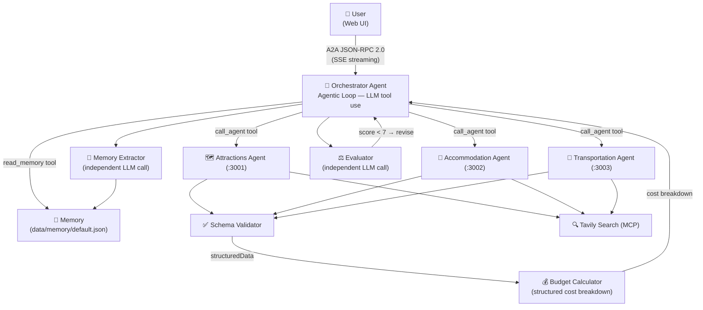

# Triplan

A multi-agent travel planning system built on [Google's A2A Protocol](https://google.github.io/A2A/) — demonstrating how independent AI agents discover, communicate, and collaborate via JSON-RPC 2.0.

## Live Demo

> **[Try it live →](https://triplan.onrender.com)**
>
> Free demo with 3 travel plans per day. No sign-up required.
> First load may take ~30 seconds (free tier cold start).

## Architecture



### How a request flows

The orchestrator uses a **3-turn confirmation loop** — users review and approve each section before the next one is generated.

```
Turn 0 — Preference gathering
  1. read_memory()             — load stored user preferences
  2. ask_user()                — 5-item check (destination, dates, travelers, budget, interests)
  3. Repeat until all key info is collected

Turn 1 — Itinerary proposal
  4. call_agent(attractions)   → JSON output → Schema Validator
  5. Present day-by-day table → ask_user("Does this itinerary work?")

Turn 2 — Accommodation (after user confirms itinerary)
  6. call_agent(accommodation) → JSON output → Schema Validator
  7. Present comparison table  → ask_user("Ready to see transport details?")

Turn 3 — Transportation + Budget (after user confirms accommodation)
  8. call_agent(transportation)→ JSON output → Schema Validator
  9. calculateBudget()         — itemised cost table appended
 10. Present routes + budget + practical tips (final response)
 11. extractAndSaveMemory()    — save new preferences for next session
```

### Key components

| Component | Role |
|-----------|------|
| **Orchestrator** | Agentic loop — LLM decides what to call and when |
| **Specialist Agents** | Attractions / Accommodation / Transportation — each outputs structured JSON |
| **Schema Validator** | Hard-checks agent JSON output; retries once with feedback on failure |
| **Evaluator** | Independent LLM scores the draft plan (0–10); injects feedback if score < 7 |
| **Budget Calculator** | Computes itemised cost breakdown from structured agent outputs; flags overage |
| **Memory Extractor** | Independent LLM extracts user preferences after each session |
| **Tavily MCP** | Real-time web search for attractions, hotels, transit routes |

### Dual-mode operation

Each sub-agent supports two modes, switchable via environment variable:

| Mode | How it works | When to use |
|------|-------------|-------------|
| `api` (default) | Orchestrator calls LLM directly — no separate process needed | Local dev, quick testing |
| `a2a` | Each agent runs as an independent process; Orchestrator sends real A2A JSON-RPC 2.0 requests | Demo, showcasing the full protocol |

## Quick Demo

Start the system and try this prompt:

> **"Plan me a 4-day Tokyo trip, budget $1000, 2 people, interested in temples and local food"**

The Orchestrator first gathers your preferences (destination, dates, travelers, budget, interests), then walks you through the plan in three turns:

**Turn 1** — Attractions specialist returns structured JSON → you see a concise day-by-day table with map → reply to confirm
**Turn 2** — Accommodation specialist returns options → you see a comparison table with map markers → reply to confirm
**Turn 3** — Transportation specialist returns routes → Budget Calculator appends cost breakdown → final response with practical tips → preferences saved to memory

Use the **Export menu** to download your itinerary as an `.ics` calendar file or copy the raw JSON.

## Features

- **Agentic Orchestrator** — LLM-driven dispatch via tool use; agents called dynamically, not hardcoded
- **Preference Gathering** — 5-item check (destination, dates, travelers, budget, interests) before planning; works with both Anthropic and Gemini providers
- **3-Turn Confirmation Flow** — Itinerary → Accommodation → Transportation presented step-by-step; users review and approve each section
- **Structured JSON output** — All specialist agents return typed JSON; Schema Validator enforces required fields with retry
- **Budget Calculator** — Itemised cost breakdown (attractions, accommodation, meals, transit) computed from structured agent output; overage sensor flags plans that exceed the stated budget (warning ≤20%, error >20%)
- **Map Visualisation** — Interactive Leaflet + OpenStreetMap map with attraction (📍) and accommodation (🏨) markers; click for details
- **Itinerary Export** — `.ics` calendar export and JSON clipboard copy from the export menu
- **Evaluator Agent** — Independent LLM scores each draft plan (0–10); score < 7 triggers up to 2 revision rounds
- **User Memory** — Preferences persist across sessions (`data/memory/default.json`); automatically applied to future plans
- **Request Logs** — Every request logged to browser localStorage; view step-by-step timeline in the Logs page
- **A2A Protocol** — Agents expose `/.well-known/agent-card.json` for capability discovery; communication follows A2A JSON-RPC 2.0
- **Real web data** — Tavily Search MCP integration fetches live attraction, hotel, and transit information
- **SSE streaming** — Real-time single-line progress display as each specialist is consulted
- **Multi-provider LLM** — Switch between Anthropic (Claude) and Google (Gemini) from the UI; no server restart needed
- **Configurable prompts** — Edit system prompts for each agent in the Settings page
- **Graceful degradation** — Schema validation failure falls back to plain text; evaluator failure is treated as passed; budget calculation failure is silently skipped

## Getting Started

### Prerequisites

- Node.js 18+
- An API key for Anthropic or Gemini (at least one)
- (Optional) A [Tavily](https://tavily.com) API key for real web search

### 1. Install dependencies

```bash
npm install
cd web && npm install && cd ..
```

### 2. Configure environment

```bash
cp .env.example .env
```

Edit `.env` and fill in your keys:

```env
# Pick one (or both)
ANTHROPIC_API_KEY=sk-ant-...
GEMINI_API_KEY=AIza...

# Default provider (anthropic | gemini)
LLM_PROVIDER=anthropic

# Optional — enables real web search for attractions/hotels/transit
TAVILY_API_KEY=tvly-...
```

### 3. Start

```bash
# Start everything: orchestrator + all sub-agents + web UI
npm run dev:all

# Backend only (no web UI)
npm run dev:agents

# Kill all ports if something is stuck
npm run kill-ports
```

Open [http://localhost:5173](http://localhost:5173) in your browser.

## Project Structure

```
src/
├── agents/
│   ├── orchestratorExecutor.ts   # Agentic loop, evaluator, memory extraction
│   ├── attractionsAgent.ts      # Attractions AgentExecutor
│   ├── accommodationAgent.ts    # Accommodation AgentExecutor
│   └── transportationAgent.ts   # Transportation AgentExecutor
├── servers/
│   ├── attractionsServer.ts     # Express server :3001
│   ├── accommodationServer.ts   # Express server :3002
│   └── transportationServer.ts  # Express server :3003
├── services/
│   ├── llmClient.ts             # AnthropicClient / GeminiClient / factory + tool use
│   ├── agentRegistry.ts         # Agent calls, schema validation, Tavily enrichment
│   ├── promptStore.ts           # docs/prompts/*.md hot-reload
│   ├── schemaValidator.ts       # JSON schema validation for agent outputs
│   ├── budgetCalculator.ts      # Cost breakdown + budget compliance sensor
│   ├── memoryService.ts         # User preference persistence (data/memory/)
│   ├── tavilyMCPClient.ts       # Tavily Search MCP client (singleton)
│   └── taskStore.ts             # In-memory task state
└── index.ts                     # Orchestrator entry point + API endpoints

web/
├── src/
│   ├── components/
│   │   ├── MapPanel.tsx         # Leaflet + OpenStreetMap interactive map
│   │   └── ExportMenu.tsx       # .ics calendar export + JSON clipboard copy
│   ├── pages/
│   │   ├── ChatPage.tsx         # Conversation UI + single-line progress + log collection
│   │   ├── LogsPage.tsx         # Request history with step-by-step timeline
│   │   └── SettingsPage.tsx     # Prompt editor + provider selector + memory clear
│   └── App.tsx
└── vite.config.ts               # Proxies /api and /message to :3000

docs/
├── prompts/                     # System prompts for all agents (.md, hot-reloaded)
│   ├── orchestrator.md
│   ├── attractions.md
│   ├── accommodation.md
│   ├── transportation.md
│   ├── evaluator.md
│   └── memory-extractor.md
└── *.md                         # Phase design documents
```

## Environment Variables

| Variable | Description | Default |
|----------|-------------|---------|
| `LLM_PROVIDER` | `anthropic` or `gemini` | `anthropic` |
| `ANTHROPIC_API_KEY` | Anthropic API key | — |
| `ANTHROPIC_MODEL` | Claude model ID | `claude-haiku-4-5-20251001` |
| `GEMINI_API_KEY` | Google Gemini API key | — |
| `GEMINI_MODEL` | Gemini model ID | `gemini-2.0-flash` |
| `TAVILY_API_KEY` | Tavily Search API key (optional) | — |
| `ATTRACTIONS_MODE` | `api` or `a2a` | `api` |
| `ACCOMMODATION_MODE` | `api` or `a2a` | `api` |
| `TRANSPORTATION_MODE` | `api` or `a2a` | `api` |
| `ATTRACTIONS_AGENT_URL` | Sub-agent URL (a2a mode) | `http://localhost:3001` |
| `ACCOMMODATION_AGENT_URL` | Sub-agent URL (a2a mode) | `http://localhost:3002` |
| `TRANSPORTATION_AGENT_URL` | Sub-agent URL (a2a mode) | `http://localhost:3003` |
| `PORT` | Orchestrator port | `3000` |
| `DAILY_PLAN_LIMIT` | Max planning sessions per user per day | `3` |

## API Endpoints (Orchestrator)

| Endpoint | Description |
|----------|-------------|
| `GET  /.well-known/agent-card.json` | A2A agent discovery |
| `POST /message/send` | Send a message (synchronous) |
| `POST /message/stream` | Send a message (SSE streaming) |
| `GET  /api/prompts` | Get current prompt configuration |
| `PUT  /api/prompts` | Update prompt configuration |
| `GET  /api/memory` | Read stored user memory |
| `DELETE /api/memory` | Clear stored user memory |
| `GET  /health` | Health check |

## Troubleshooting

**Ports already in use**
```bash
npm run kill-ports
```

**`ANTHROPIC_API_KEY` / `GEMINI_API_KEY` missing**
The server will start but requests will fail. Check your `.env` file and restart with `npm run dev:all`.

**Sub-agents not responding (a2a mode)**
Make sure you've set `ATTRACTIONS_MODE=a2a` etc. and that `npm run dev:all` started all four processes. Check each agent's health: `curl http://localhost:3001/health`

**Tavily search not working**
Tavily is optional. Without `TAVILY_API_KEY`, agents fall back to LLM knowledge. Add the key to `.env` and restart.

**Web UI shows blank page**
Make sure you ran `npm install` inside the `web/` directory, and that the orchestrator is running on `:3000`.

## Deployment

### Render (recommended for demo)

This project includes a `render.yaml` for one-click deployment:

1. Fork this repo
2. Connect your GitHub account to [Render](https://render.com)
3. Create a new **Web Service** → select your fork
4. Set environment variables: `ANTHROPIC_API_KEY` (or `GEMINI_API_KEY`), optionally `TAVILY_API_KEY`
5. Deploy — Render will run `npm install && npm run build:all` and start the server

The free tier spins down after 15 minutes of inactivity. First request after idle takes ~30 seconds.

### Local development

See [Getting Started](#getting-started) above.

## Roadmap

- [x] Phase 0 — Replace internal SDK with Anthropic SDK; build LLM abstraction layer
- [x] Phase 1 — Real A2A sub-agents with agent-card and health endpoints
- [x] Phase 2 — React web UI (chat + settings)
- [x] Phase 3 — Multi-provider LLM support (Anthropic + Gemini)
- [x] Phase 4 — MCP tool integration (Tavily Search for real attraction + hotel data)
- [x] Phase 5 — SSE streaming for real-time agent progress
- [x] Phase 6 — Transportation Agent + intent classification + prompt hot-reload
- [x] Phase 7 — Retry logic with exponential backoff; unified prompt system
- [x] Phase 8 — Agentic Orchestrator: LLM tool use drives agent dispatch
- [x] Phase 9 — Polish & demo readiness
- [x] Phase 10 — Evaluator Agent: independent quality scoring with feedback loop
- [x] Phase 11 — User Memory: cross-session preference persistence
- [x] Phase 12 — UX polish: single-line progress, response timing, request logs, improved memory extraction
- [x] Phase 13 — Orchestrator conversation flow optimization (prompt-only)
- [x] Phase 14 — Structured output: agents return typed JSON; Schema Validator with retry
- [x] Phase 15 — Budget calculation: itemised cost breakdown with overage alerts
- [x] Phase 16 — Map visualisation (Leaflet + OpenStreetMap) + itinerary export (.ics, JSON)
- [ ] Phase 17 — Multi-round refinement: partial updates without full regeneration
- [ ] Phase 18 — Context awareness: weather, holidays, visa requirements
- [x] Phase 19 — 3-turn confirmation flow: itinerary → accommodation → transport (prompt-only)
- [ ] Phase 20 — PDF export: one-click download of the complete plan
- [ ] Phase 21 — Multi-city itineraries: 2–4 cities with inter-city transport
- [ ] Phase 22 — Real-time travel assistant: nearby attractions, navigation, weather on the go

## License

Apache 2.0
