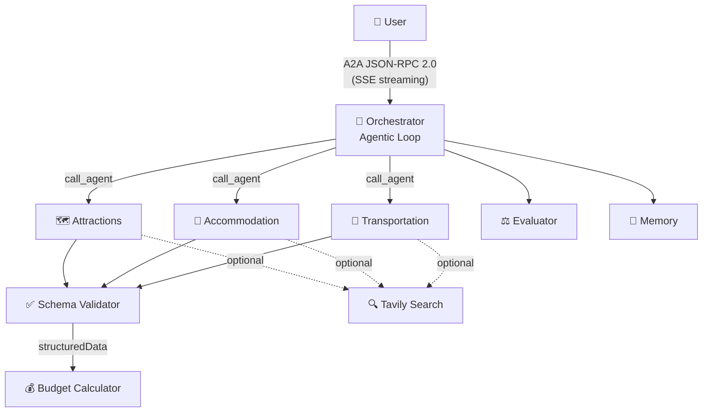

# Triplan

AI-powered travel planner built on [Google's A2A Protocol](https://google.github.io/A2A/) — multiple AI agents collaborate to plan your perfect trip.

[](LICENSE)
[]()
[](https://render.com)

## Live Demo

> **[Try it live →](https://triplan.onrender.com)**
>
> Free · 3 plans per day · No sign-up required
> First load may take ~30s (free tier cold start)

<!-- TODO: Add screenshot here -->
<!--  -->

## Features

- **Multi-agent planning** — Attractions, Accommodation, and Transportation specialists collaborate via A2A Protocol
- **3-turn confirmation** — Review and approve each section (itinerary → hotels → transport) before moving on
- **Interactive map** — Leaflet + OpenStreetMap with attraction and hotel markers
- **Budget tracking** — Itemised cost breakdown with overage alerts
- **User memory** — Preferences persist across sessions for personalised plans
- **Real web data** — Tavily Search MCP fetches live attraction, hotel, and transit info
- **Itinerary export** — Download as `.ics` calendar or copy as JSON
- **Multi-provider LLM** — Switch between Claude and Gemini from the UI

## Tech Stack

**Backend:** Node.js · TypeScript · Express · [A2A SDK](https://google.github.io/A2A/) · Anthropic / Gemini SDK · MCP
**Frontend:** React · Vite · Tailwind CSS · Leaflet · React Router

## Getting Started

```bash
# 1. Install
npm install && cd web && npm install && cd ..

# 2. Configure
cp .env.example .env
# Edit .env — add GEMINI_API_KEY or ANTHROPIC_API_KEY

# 3. Run
npm run dev:all
```

Open [http://localhost:5173](http://localhost:5173) and try:
> *"Plan me a 4-day Tokyo trip, budget $1000, 2 people, interested in temples and local food"*

## Architecture



The orchestrator uses **LLM tool use** to decide which agents to call and when — no hardcoded flow. Each agent outputs structured JSON validated by a schema checker with retry.

See [`CLAUDE.md`](CLAUDE.md) for detailed architecture documentation.

## Deployment

This project includes a `render.yaml` for one-click deployment on [Render](https://render.com):

1. Fork this repo
2. Create a new **Web Service** on Render → select your fork
3. Set environment variables: `GEMINI_API_KEY` (or `ANTHROPIC_API_KEY`)
4. Deploy

## Roadmap

- [ ] Multi-round refinement — partial updates without full regeneration
- [ ] Context awareness — weather, holidays, visa requirements
- [ ] PDF export — one-click download of the complete plan
- [ ] Multi-city itineraries — 2–4 cities with inter-city transport

## License

[Apache 2.0](LICENSE)
